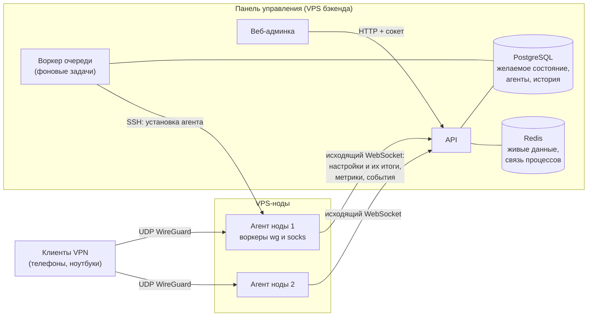
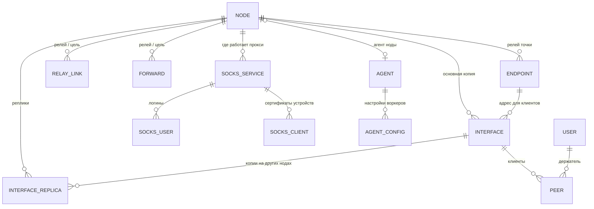
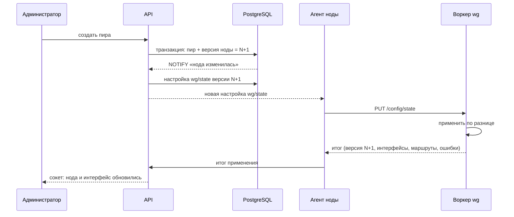
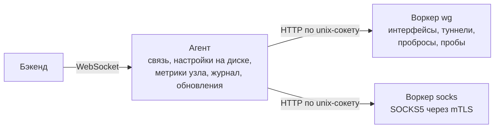
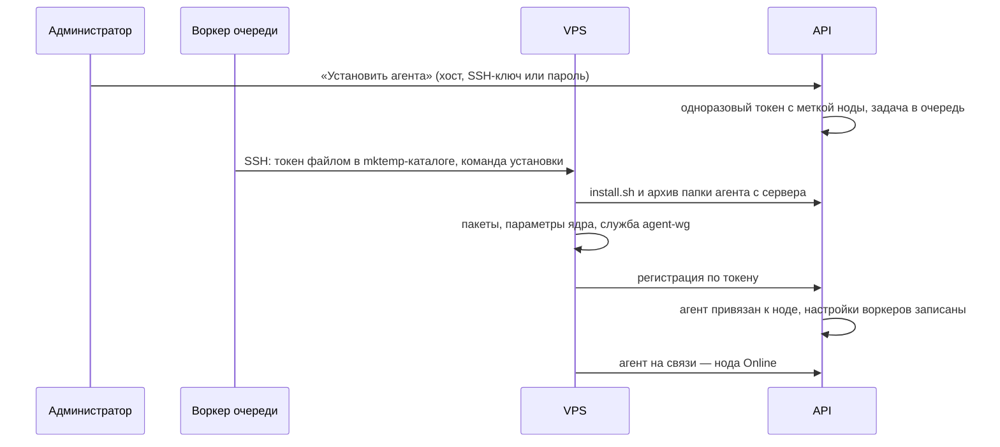
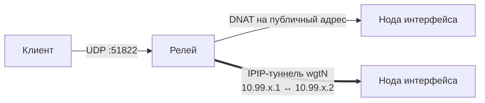
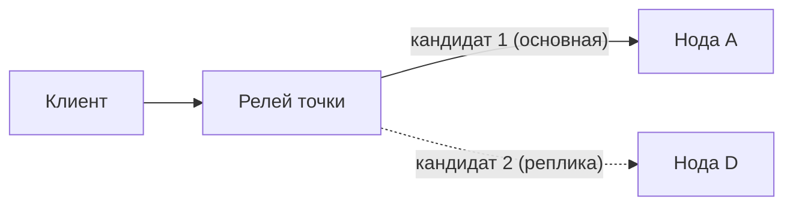
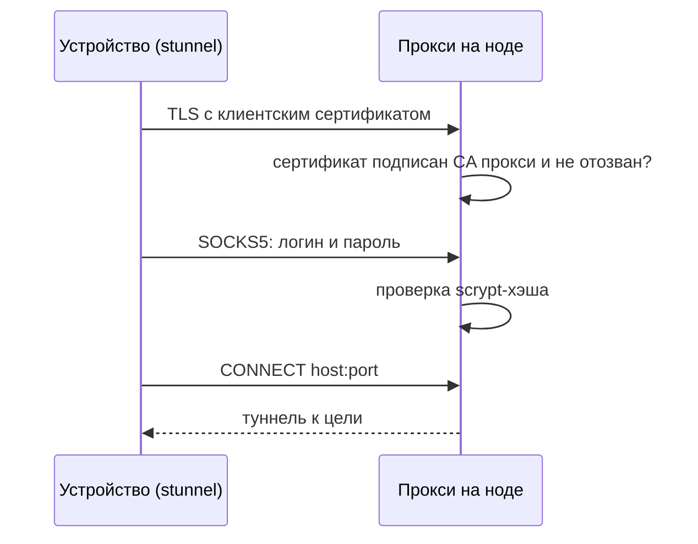
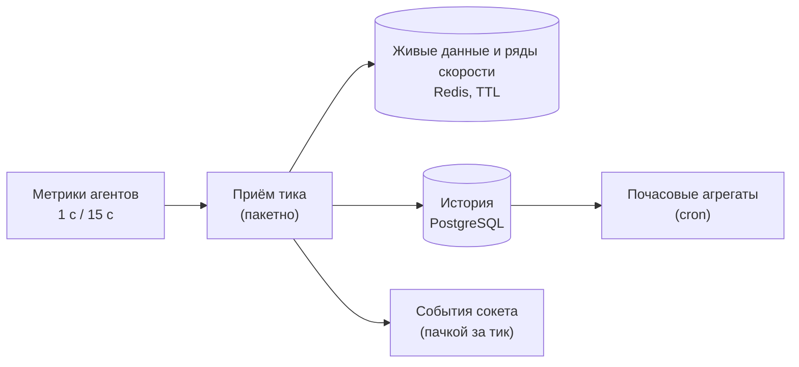

# WG Admin: как устроена система

Документ описывает, из чего состоит админка WireGuard, как части связаны между
собой и что происходит при каждом действии администратора. Кода здесь нет —
только устройство, потоки данных и правила. Детали реализации отдельных
модулей — в `README.md` внутри `src/modules/agent` и `src/modules/wg-*`,
воркеры узла — в `agent/README.md`.

## 1. Общая картина

Система — это **панель управления** (бэкенд + веб) и **агенты** на VPS-нодах.
Агент — готовая программа ([github.com/epifanovmd/agent](https://github.com/epifanovmd/agent),
версия 1.3.0): держит связь с бэкендом, хранит настройки, присылает метрики
узла и обновляется сам. Работу с WireGuard делают **воркеры** проекта — `wg` и
`socks`, небольшие программы на Go, которые агент запускает на узле.

Бэкенд никогда не выполняет команды на серверах сам: он хранит _желаемое
состояние_ каждой ноды и передаёт его воркерам как **настройки**, а воркеры
приводят сервер в соответствие.



Ключевые свойства:

- **Агенту не нужны входящие порты.** Он сам держит исходящее соединение с
  бэкендом (WebSocket) со своим ключом; панель не подключается к нодам (кроме
  установки агента по SSH).
- **Декларативность.** Администратор меняет желаемое состояние в БД, воркер
  приводит сервер к нему. Повторное применение ничего не ломает.
- **Автономность.** Агент хранит последние настройки на диске и после
  перезапуска сам передаёт их воркерам: после перезагрузки сервера VPN
  поднимается, даже если бэкенд недоступен.
- **Реальное время.** Все страницы веба обновляются по сокету, опроса по
  таймеру нет.

## 2. Процессы и хранилища

| Компонент  | Роль                                                                                                      |
| ---------- | --------------------------------------------------------------------------------------------------------- |
| `api`      | HTTP API, сокет для веба, соединения агентов (`/api/v1/agent-link`)                                       |
| `worker`   | Очередь задач (pg-boss): установка/удаление агента по SSH, сверка настроек воркеров, периодические задачи |
| `migrate`  | Одноразовый запуск миграций схемы БД при деплое                                                           |
| PostgreSQL | Всё постоянное: ноды, интерфейсы, пиры, ключи (зашифрованы), агенты и настройки воркеров, история, задачи |
| Redis      | Живые данные, общие для процессов: текущая скорость и трафик, здоровье туннелей, матрица связности        |

Сигналы между процессами идут через PostgreSQL (`LISTEN/NOTIFY`): изменение
версии ноды будит запись настроек её воркеров, а новая настройка агента доходит
до процесса API, где открыто соединение этого агента, и сразу уходит на узел.

## 3. Модель данных



| Сущность           | Что это                                                                                                     |
| ------------------ | ----------------------------------------------------------------------------------------------------------- |
| Нода               | VPS. Публичный адрес, привязанный агент, статус по агенту, версия конфигурации (желаемая и применённая), ОС |
| Интерфейс          | WireGuard-сервер на ноде: подсеть, порт, ключ, DNS/MTU для клиентов, NAT, точка подключения                 |
| Реплика интерфейса | Копия интерфейса на другой ноде с тем же ключом, адресами и пирами — резерв                                 |
| Пир                | Клиент VPN: ключи, адрес в подсети, срок действия, держатель, трафик и последний handshake                  |
| Точка подключения  | Стабильный адрес, который попадает в конфиги клиентов; напрямую на ноду или через релей                     |
| Релей-линк         | Пара «релей → нода-цель» с собственной /30-подсетью для IPIP-туннеля; создаётся и удаляется автоматически   |
| Проброс            | Порт на релее, ведущий на внешний сервис (UDP/TCP), напрямую или через туннель                              |
| Прокси SOCKS5      | Прокси на ноде: вход по клиентскому сертификату (mTLS), затем логин и пароль                                |
| Агент              | Агент на узле (модуль agent): ключ, связь, воркеры и их самочувствие, метрики, события воркеров             |
| Настройка воркера  | Ключ и значение для воркера агента (`wg/state`, `wg/probes`, `socks/proxies`) с версией и итогом применения |

Все приватные ключи (WireGuard, PSK, ключи CA и сертификатов прокси, SSH-ключи
в задачах установки) хранятся в БД зашифрованными ключом приложения
(`WG_SECRETS_KEY`, AES-256-GCM). Настройки воркеров несут приватные ключи
открытыми для узла, поэтому их значения в БД шифруются ключом
`AGENT_CONFIGS_KEY`.

## 4. Желаемое состояние и версии

У каждой ноды есть **версия конфигурации**. Любое изменение, которое касается
ноды (интерфейс, пир, точка, проброс, прокси, реплика), в той же транзакции
увеличивает версию всех затронутых нод. Бэкенд собирает из БД настройки
воркеров ноды и записывает те, что изменились:

| Настройка       | Что в ней                                                                              |
| --------------- | -------------------------------------------------------------------------------------- |
| `wg/state`      | желаемое состояние ноды с версией конфигурации: интерфейсы с пирами, туннели, пробросы |
| `wg/probes`     | другие ноды, до которых воркер wg проверяет связность                                  |
| `socks/proxies` | прокси ноды: порт, сертификаты, разрешённые отпечатки, хэши паролей                    |

Воркер wg отвечает **итогом применения**: какую версию применил, статусы
интерфейсов, выбранные маршруты пробросов, ошибки. Совпадение версий —
«конфигурация на ноде актуальна».



Состояние всегда передаётся **целиком**, а не изменениями: воркер сравнивает
его с тем, что уже стоит на сервере, и трогает только различия.

- Изменились только пиры — `wg syncconf` без разрыва соединений.
- Изменились параметры интерфейса — интерфейс перезапускается.
- Туннель с теми же параметрами не пересоздаётся — трафик релея не рвётся.

Запись настроек будит сигнал изменения ноды; страховка — задача
`wg.agent-sync` раз в 10 минут сверяет настройки всех нод с БД (неизменённые
ключи не трогаются). Агент без связи получает настройки при подключении.

Если применить не удалось (порт занят чужим процессом, конфликт туннеля), ошибка
приходит в итоге и видна на странице ноды. Воркер повторяет применение сам.

## 5. Агент и воркеры ноды

Агент — служба systemd на Linux; на узле он ставится отдельным экземпляром
`wg` (`instance` в `agent/agent.prod.yaml`): свои каталоги `/opt/agent-wg`, `/etc/agent-wg`,
`/var/lib/agent-wg` и служба `agent-wg`, поэтому на том же узле может работать
агент другого проекта. Как агент и воркеры говорят между собой, что в
настройках и ответах воркеров — в [agent/README.md](../agent/README.md).



### Связь с бэкендом

Агент держит одно постоянное соединение с бэкендом (WebSocket,
`/api/v1/agent-link`, ключ агента выдаётся при регистрации). По нему идёт всё:
бэкенд присылает настройки и запросы к воркерам, агент — итоги применения,
самочувствие воркеров, метрики и события воркеров. Подробно о связи, хранении и
правах — `src/modules/agent/README.md`.

- **Статус ноды — по агенту:** агент отозван — нода «Создана» (ждёт новой
  установки), агент без связи — Offline, воркер wg или socks не работает или
  не в порядке — «Ошибка» с причиной, иначе Online. ОС, ядро, режим WireGuard
  и занятые порты узла приходят в самочувствии воркера wg.
- **Быстрый Offline.** Бэкенд проверяет соединение ping-ом раз в 5 с; после
  обрыва агент считается на связи ещё `AGENT_OFFLINE_GRACE_MS` (3 с).
- **Частота метрик по спросу.** Обычно агент присылает метрики раз в
  `AGENT_METRICS_INTERVAL_MS` (15 с). Пока админку смотрит хотя бы один
  пользователь (признак зрителей — в Redis, общий для процессов), бэкенд
  наблюдает за агентами нод и получает метрики раз в секунду.
- **Метрики** — метрики узла от агента (процессор, память, диск, сеть) и
  метрики воркеров: пиры (`wg show dump`), пробы туннелей и нод, маршруты
  пробросов, счётчики прокси. Из них строится статистика (раздел 10).
- **Запрос к воркеру.** Перезапуск интерфейса — синхронный запрос к воркеру wg
  через агента; ответ — итог перезапуска.
- **Масштабирование.** Соединение агента живёт в одном процессе API. Изменения
  настроек расходятся по процессам сигналом, и процесс с соединением досылает
  их сам. Вызовы, которым нужно соединение (запрос к воркеру, журнал,
  обновление), при нескольких копиях API пересылаются в нужную копию
  (`AGENT_RELAY_*`) или требуют «липкого» балансировщика; при одной копии API
  пересылка не нужна.

**Что воркеры делают на сервере:**

- поднимают интерфейсы WireGuard (`wg-quick`), NAT через исходящий интерфейс;
- создают IPIP-туннели `wgtN` до других нод;
- ставят правила iptables в своих цепочках `WG_ADMIN_*` (пробросы, разрешения
  пересылки) — чужие правила не трогают;
- держат SOCKS5-прокси (TLS с проверкой клиентского сертификата);
- собирают статистику `wg show`, занятые порты, пингуют туннели, реплики и
  другие ноды.

**Защита от чужого.** Воркер wg трогает только то, что создал сам. Чужой
конфиг интерфейса с тем же именем не перезаписывается. Туннель не поднимается,
если его подсеть пересекается с адресом на другом интерфейсе или к тому же
хосту уже есть чужой IPIP-туннель. Проброс не ставится на порт, который слушает
другой процесс. Бэкенд знает занятые порты хоста из самочувствия воркера wg и
не даёт их выбрать.

**Остановка и перезапуск:**

| Событие                                                     | Что происходит                                                                                       |
| ----------------------------------------------------------- | ---------------------------------------------------------------------------------------------------- |
| Остановка службы, обновление агента или воркера (`SIGTERM`) | Воркеры выходят, ничего не разбирая: интерфейсы, туннели и правила остаются, клиенты не теряют связь |
| Удаление агента                                             | Воркеры убирают всё своё (`POST /cleanup`): интерфейсы, туннели, правила, прокси                     |
| Перезагрузка сервера, бэкенд недоступен                     | Агент передаёт воркерам сохранённые настройки, а когда бэкенд появится — получает новые              |

### Установка, обновление, удаление

Установка одна и для админки по SSH, и для ручного запуска — команда с
бэкенда:

```bash
curl -fsSL '<бэкенд>/api/v1/agent-bundle/install.sh' | sudo sh -s -- --token '<токен>' --name '<нода>'
```

Команду с одноразовым токеном выдаёт создание ноды и запрос новой команды
установки на странице ноды. Скрипт скачивает с бэкенда архив папки агента под
машину узла (`agent pack`) и запускает из него `agent install`. Всё остальное —
экземпляр `wg`, права root, пакеты, параметры ядра, воркеры wg и socks — задаёт
`agent/agent.prod.yaml` внутри архива, флагов для этого в команде нет.



- **Привязка к ноде.** Токен ноды несёт метку `nodeId`: зарегистрированный по
  нему агент привязывается к ноде сам. При общем токене `AGENT_BOOTSTRAP_TOKEN`
  нода берётся из метки агента или по имени (нода без агента с тем же именем).
  Привязать агента вручную можно на странице ноды. После привязки агент сразу
  получает настройки воркеров из БД.
- **По SSH** токен передаётся файлом (`--token-file`) во временном каталоге
  `mktemp`: в аргументах команд его не видно; каталог удаляется после запуска.
  Перед установкой снимается служба `wg-admin-agent`, если она есть на узле.
- **Сборки.** Установка — архив папки агента из `AGENT_BUNDLE_DIR` (в образе
  его собирает стадия `agent-bundle`, для разработки — `yarn agent:pack`): в нём
  агент, настройки, воркеры wg и socks и их подписанные сборки (`release/`) —
  ими бэкенд обновляет воркеры. Новые версии агента бэкенд берёт из релизов
  GitHub: проверяет при запуске и раз в час, новейшая версия в диапазоне `^1`
  (`AGENT_RELEASES_*`); узел скачивает программу агента с GitHub по
  перенаправлению бэкенда. Новая версия агента не требует пересборки бэкенда:
  админка сразу показывает доступное обновление (сокет-событие о новой версии),
  агент на узле тоже сам проверяет обновления (`sudo agent-wg upgrade`).
- **Обновление** агента и каждого воркера — из админки. Агент принимает
  сборку, только если её подпись (Ed25519) сходится с одним из его ключей:
  агента подписывает автор агента (ключ вшит в агента), воркеры wg и socks —
  ключ проекта `AGENT_SIGNING_KEY` при `agent pack` (пара — `agent keygen`;
  открытый ключ лежит в архиве, и `agent install` добавляет его узлу). Агент, который после обновления три
  запуска подряд не вышел на связь, возвращается к прежней версии; воркер,
  который после обновления не стал здоров, — тоже.
- **Удаление** — `/opt/agent-wg/bin/agent uninstall --instance wg --purge`:
  воркеры убирают своё, удаляются служба, настройки, данные и пакеты,
  поставленные установкой. Затем агент отзывается и удаляется, нода —
  «Создана»: конфигурация в БД сохраняется и уйдёт новому агенту.

## 6. Точки подключения и релей

Адрес в конфиге клиента (`Endpoint`) выбирается так:

1. есть точка подключения — её хост и порт на точке (или порт интерфейса);
2. иначе — публичный адрес ноды и порт интерфейса.

**Точка «напрямую»** — просто стабильное имя (DNS) ноды. Позволяет менять IP
ноды, не пересоздавая конфиги.

**Точка «через релей»** — клиенты подключаются к другой ноде (релею), а та
пересылает UDP до ноды интерфейса:



- **DNAT** — релей переадресует пакеты на публичный адрес ноды.
- **Маршрут** при IPIP: «авто» — туннель, а если он не отвечает ~30 с, прямой
  адрес той же ноды; «только туннель»; «напрямую». При отказе ноды целиком релей
  переходит на копию интерфейса (раздел 7).
- **IPIP-туннель** — релей отправляет пакеты внутрь туннеля до ноды. Нужен, когда
  прямой UDP до ноды теряется или режется (хостер, страна). Туннели и их /30
  адреса (из `WG_RELAY_TUNNEL_CIDR`) система выделяет сама: на каждую пару
  «релей → нода» создаётся ровно один туннель, пока он кем-то используется.
- Порты на релее общие для всех его точек, пробросов и собственных
  интерфейсов — система не даёт выбрать занятый.
- Релей не может обслуживать точку для интерфейса на самом себе.

Здоровье туннелей видно на странице ноды: воркеры wg обеих сторон пингуют дальний
конец каждые ~10 с (задержка, потери, проверка MTU).

## 7. Реплики и переключение

Интерфейс может иметь **копии на других нодах** — с тем же ключом, адресами и
пирами. Любое изменение интерфейса или пира применяется на всех копиях.



- Релей точки держит путь до всех копий и получает их список по приоритету:
  основная первой. Реплика попадает в список, только когда интерфейс на ней
  поднялся (по итогу применения её воркера wg): копия на ноде без агента или с ошибкой
  трафик не получит. Реплика поднялась или упала — релей сразу получает
  новый список.
- При IPIP с маршрутом «авто» у каждой копии два кандидата: туннель, затем
  прямой адрес той же ноды (лёг только туннель — клиенты остаются на ноде);
  «только туннель» / «напрямую» и DNAT — по одному.
- Воркер wg релея выбирает **первую живую копию** по своим пробам (пинг туннеля или
  адреса). Три неудачи подряд (~30 с) — переход на следующую, первая удачная
  проба — возврат.
- При смене цели воркер сбрасывает записи conntrack этого порта, иначе поток
  клиента остался бы на мёртвой ноде.
- Копия, которая сейчас обслуживает трафик, видна в таблице интерфейсов.
  Администратор может **закрепить** трафик на конкретной копии (тогда
  автоматики нет) или вернуть «авто». Закрепить можно только копию, где
  интерфейс поднят.
- Переключение работает только для интерфейсов с точкой через релей: клиенту
  нужен один постоянный адрес.

**Перенос** интерфейса на другую ноду сохраняет ключ и пиров; с точкой
подключения конфиги клиентов не меняются.

## 8. Пробросы

Проброс — порт на релее, ведущий на сервис, которым панель не управляет
(свой WireGuard в контейнере, TLS-прокси и т. п.). UDP или TCP.

| Путь       | Как идёт трафик                                                                      |
| ---------- | ------------------------------------------------------------------------------------ |
| Напрямую   | DNAT на адрес цели (или публичный адрес ноды-цели)                                   |
| Через IPIP | Нужна нода-цель с агентом: трафик идёт внутрь туннеля, прямой адрес — аварийный путь |

Маршрут для пути через туннель:

- **Авто** — воркер wg релея сам уходит на прямой путь, если туннель не отвечает
  ~30 с, и возвращается, когда туннель ожил;
- **Только туннель** / **Напрямую** — принудительно.

Текущий маршрут виден в таблице пробросов. Выключенный проброс порт на релее
не держит: порт можно отдать интерфейсу, а проброс оставить для отката;
включить его можно, только пока порт не занят интерфейсом, точкой или другим
пробросом. Заранее созданный выключенный
проброс можно включить, пока порт ещё занят другим процессом, — воркер wg поставит
его сам, как только порт освободится.

## 9. Прокси SOCKS5 через mTLS

Прокси работает в воркере socks ноды. Вход — в два шага:



- При создании прокси сервис создаёт свой CA (ECDSA P-256) и серверный
  сертификат. На каждое устройство — свой клиентский сертификат.
- Воркеру уходят только отпечатки разрешённых сертификатов и хэши паролей.
- **Отзыв сертификата** или выключение пользователя разрывает их текущие
  соединения сразу, без перезапуска прокси.
- Для устройства скачивается готовый архив для macOS: сертификаты, установка
  stunnel, автозапуск, локальный SOCKS5 `127.0.0.1:1080` и ссылка для
  Telegram.
- Прокси может быть доступен клиентам через проброс на другой ноде — тогда
  у прокси указываются адрес и порт для клиентов.
- Порт прокси защищён от пересечения с пробросами.

## 10. Статистика



- **Счётчики монотонны**: сброс счётчиков WireGuard (перезапуск интерфейса)
  компенсируется, суммарный трафик пира не падает.
- **Приём тика** — пакетный: живые данные читаются и пишутся в Redis одним
  проходом, история — одной вставкой, счётчики пиров — одним запросом.
  Точка ставится на момент сбора метрик на узле. Тик старше 10 с идёт только в
  историю, без событий; старше часа — отбрасывается.
- **Живые данные** — текущая скорость и трафик пира, интерфейса, ноды, общей
  сводки — в Redis. Пока админку смотрят, события в сокет уходят каждый тик;
  без зрителей — только при заметном изменении скорости или раз в 30 с тишины.
  Статистика пиров приходит одним событием за тик на комнату: обзору — все
  пиры, странице интерфейса — его пиры, списку своих подключений — пиры
  держателя, карточке пира — только он; без дублей.
- **Ряды скорости** — последние 600 точек скорости ноды, интерфейса и пира
  (Redis). Графики на страницах сразу показывают последние минуты, дальше
  продолжаются по сокету.
- **История**: точка на пира раз в минуту (и при смене онлайн), метрики ноды
  раз в минуту, почасовые агрегаты для длинных периодов. Старые записи
  удаляются по сроку хранения (`WG_STATS_*_RETENTION_*`).
- **Онлайн** пира — handshake свежее 3 минут.
- **Связность нод** — каждая нода раз в минуту пингует остальные; на дашборде —
  матрица «откуда → куда».

## 11. Реальное время

Веб подписывается на комнаты сокета; вход в комнату проверяется правами.

| Комната                                   | Кто может войти              | Что приходит                                                                    |
| ----------------------------------------- | ---------------------------- | ------------------------------------------------------------------------------- |
| `wg-overview`                             | просмотр статистики          | только статистика: сводка, скорость нод, статистика пиров, матрица связности    |
| `wg-nodes`                                | просмотр нод                 | создание, изменение, статус и удаление нод                                      |
| `wg-interfaces`                           | просмотр интерфейсов         | изменение и удаление интерфейсов (и при изменении их точки)                     |
| `wg-peers`                                | просмотр пиров               | создание, изменение и удаление пиров                                            |
| `wg-node_<id>`                            | просмотр нод                 | нода и её удаление, метрики, здоровье туннелей, установка агента                |
| `wg-interface_<id>`                       | просмотр интерфейсов         | интерфейс, его статистика, статистика его пиров (пачкой за тик)                 |
| `wg-peer_<id>`                            | просмотр пиров или свой пир  | пир и его статистика                                                            |
| `wg-peers-own_<userId>`                   | держатель пиров, только своя | статистика своих пиров (список своих подключений)                               |
| `wg-endpoints`, `wg-forwards`, `wg-socks` | просмотр раздела             | изменения списка и интерфейсов точек, маршрут пробросов, статистика прокси      |
| Личный канал                              | держатель пира               | изменения и удаление своих пиров; снятие пира — как удаление                    |
| `agents`, `agent_<id>`                    | доступ к агентам             | агенты: связь, воркеры, события; у `agent_<id>` — метрики раз в секунду, журнал |

Список и карточка получают изменения из разных комнат: страница ноды, интерфейса
или обзор подписываются на нужные комнаты списков. Когда пир переходит к другому
держателю или снимается, прежний держатель получает удаление пира и теряет доступ
к его комнате; при смене прав комнаты без права закрываются сразу.

После переподключения сокета страница перечитывает данные и снова входит в
комнаты.

## 12. Доступ

Права выдаются ролями; суперпользователь (`*`) может всё.

| Раздел     | Права                                                                                                                                                                                                                                                                         |
| ---------- | ----------------------------------------------------------------------------------------------------------------------------------------------------------------------------------------------------------------------------------------------------------------------------- |
| Ноды       | `wg:node:view` (и метрики), `wg:node:create`, `wg:node:update`, `wg:node:delete`, `wg:node:agent` (команда установки, привязка, обновление и перезапуск агента и воркеров), `wg:node:logs` (журнал агента и воркеров), `wg:node:provision` (SSH), `wg:node:assign` (владелец) |
| Точки      | `wg:endpoint:view`, `wg:endpoint:create`, `wg:endpoint:update`, `wg:endpoint:delete`                                                                                                                                                                                          |
| Интерфейсы | `wg:interface:view`, `wg:interface:create`, `wg:interface:update`, `wg:interface:delete`, `wg:interface:control` (включение, выключение, перезапуск), `wg:interface:move`, `wg:interface:replicas`, `wg:interface:hooks` (свои PostUp/PostDown)                               |
| Пиры       | `wg:peer:view`, `wg:peer:create`, `wg:peer:update`, `wg:peer:delete`, `wg:peer:toggle` (включение-выключение любых), `wg:peer:psk`, `wg:peer:assign` (владелец), `wg:peer:own` — свои пиры, конфиг и QR, включение-выключение                                                 |
| Пробросы   | `wg:forward:view`, `wg:forward:create`, `wg:forward:update`, `wg:forward:delete`                                                                                                                                                                                              |
| Прокси     | `wg:socks:view`, `wg:socks:create`, `wg:socks:update`, `wg:socks:delete`, `wg:socks:users`, `wg:socks:secrets` (пароли пользователей), `wg:socks:clients` (сертификаты и клиенты устройств)                                                                                   |
| Статистика | `wg:stats:view` — вся, `wg:stats:own` — по своим пирам                                                                                                                                                                                                                        |

Роль `user` по умолчанию получает `wg:peer:own` и `wg:stats:own`: обычный
пользователь видит только свои подключения.

Свои PostUp/PostDown для интерфейса задаёт только обладатель `wg:interface:hooks`
(или суперпользователь).

Сокет-комнаты проверяют актуальные права из БД на каждом входе; HTTP-запросы —
права из access-токена, который после смены прав отклоняется и обновляется
клиентом.

**Агенты** открываются правами модуля agent (`agent:view`, `agent:manage`,
`agent:config`, `agent:fetch`, `agent:logs`, `agent:enroll`) — на все агенты —
или через ноду: агент ноды доступен с правом ноды на действие (`wg:node:view`,
`wg:node:logs`, `wg:node:agent`), в том числе только на свои ноды.

**Токен регистрации** агента — одноразовый, с меткой ноды и сроком; выдаётся
при создании ноды, по запросу команды установки и при установке по SSH, секрет
показывается один раз. При регистрации агент получает свой ключ; отзыв агента
закрывает его соединение.

## 13. Фоновые задачи

| Задача               | Когда               | Что делает                                                               |
| -------------------- | ------------------- | ------------------------------------------------------------------------ |
| `wg.provision-node`  | «Установить агента» | Установка агента по SSH, прогресс и журнал — в задаче и на странице ноды |
| `wg.uninstall-node`  | «Удалить агента»    | Удаление агента по SSH: воркеры убирают своё, агент отзывается           |
| `wg.agent-sync`      | cron, раз в 10 мин  | Сверка настроек воркеров всех нод с БД                                   |
| `wg.peer-expiry`     | cron                | Выключение пиров с истёкшим сроком                                       |
| `wg.stats-rollup`    | cron                | Почасовые агрегаты статистики                                            |
| `wg.stats-retention` | cron                | Удаление старой истории                                                  |
| `agents.prune`       | cron, раз в час     | Удаление старых событий воркеров                                         |

Периодические задачи выполняются одним воркером очереди на кластер (расписание
в очереди, не таймеры процессов).

## 14. Развёртывание и настройка

- Бэкенд — один образ для `api`, `worker` и `migrate`. Архивы папки агента
  для узлов (`agent pack --env prod` под linux/amd64 и linux/arm64: агент,
  настройки, воркеры wg и socks) собираются в том же образе
  (`/app/agent/bundle`); новые версии агента бэкенд берёт из релизов GitHub. Подпись воркеров ключом проекта — необязательный секрет
  сборки `agent_signing_key` (в `release.yml` — секрет `AGENT_SIGNING_KEY`).
- `make deploy` — синхронизация исходников, сборка на хосте, миграции, запуск.
- Версия сборки (`git describe`, короткий SHA, время) передаётся в образ
  build-аргументами (`make`, релизный workflow) и видна любому вошедшему в
  `GET /api/v1/app/version`.
- Важные переменные окружения (все переменные агентов — в `.env.example`):

| Переменная                                                | Зачем                                                                  |
| --------------------------------------------------------- | ---------------------------------------------------------------------- |
| `APP_PUBLIC_URL`, `AGENT_PUBLIC_URL`                      | Адрес бэкенда, который увидят агенты (`install.sh`, команда установки) |
| `WG_SECRETS_KEY`                                          | Ключ шифрования секретов в БД. Потеря = потеря всех приватных ключей   |
| `AGENT_CONFIGS_KEY`                                       | Ключ шифрования значений настроек воркеров в БД                        |
| `AGENT_BUNDLE_DIR`                                        | Архивы папки агента для узлов (по умолчанию `agent/bundle`)            |
| `AGENT_RELEASES_GITHUB`, `AGENT_RELEASES_RANGE`           | Откуда брать агента: `epifanovmd/agent`, версии `^1`                   |
| `AGENT_RELEASES_URL`, `AGENT_RELEASES_PROXY`              | Своё зеркало сборок агента; сборки узлам через бэкенд                  |
| `AGENT_BOOTSTRAP_TOKEN`                                   | Общий токен регистрации для разработки и стендов                       |
| `AGENT_METRICS_INTERVAL_MS`, `AGENT_STATUS_INTERVAL_MS`   | Частота метрик и самочувствия агентов без зрителей (15 с)              |
| `AGENT_OFFLINE_GRACE_MS`                                  | Сколько агент считается на связи после обрыва (3 с)                    |
| `AGENT_RELAY_*`                                           | Несколько копий API: пересылка вызовов в копию с соединением агента    |
| `WG_RELAY_TUNNEL_CIDR`                                    | Пул адресов для IPIP-туннелей (по умолчанию `10.99.0.0/16`)            |
| `WG_STATS_*_RETENTION_*`, `WG_NODE_METRIC_RETENTION_DAYS` | Сроки хранения истории                                                 |

- Прокси перед бэкендом должен пропускать WebSocket на `/api/v1/agent-link`
  (Caddy делает это сам).
- По `http` ключ агента и настройки воркеров с приватными ключами идут
  открытым текстом — задача установки предупреждает об этом; для продакшена
  нужен HTTPS (профиль `https` в compose — Caddy).

## 15. Диагностика

| Симптом                              | Где смотреть                                                                                                        |
| ------------------------------------ | ------------------------------------------------------------------------------------------------------------------- |
| Нода Offline                         | Агент не выходит на связь: `sudo agent-wg status`, `sudo agent-wg logs -f` на VPS                                   |
| Нода в статусе «Ошибка»              | Причина у ноды: воркер wg или socks не запущен или не в порядке; журнал агента и воркеров (вкладка ноды)            |
| Агент не подключается вовсе          | Прокси перед бэкендом не пропускает WebSocket на `/api/v1/agent-link`                                               |
| «Ошибка применения конфигурации»     | Текст ошибки на странице ноды; воркер wg повторяет применение сам после устранения причины                          |
| Интерфейс в статусе «Ошибка»         | Сообщение у интерфейса и журнал воркера wg (вкладка ноды)                                                           |
| Клиент не подключается               | Handshake пира; адрес подключения интерфейса; здоровье туннеля релея; маршрут проброса                              |
| Установка агента не прошла           | Журнал задачи установки (построчно, с временем шагов)                                                               |
| Обновление воркера не принято        | Сборки без подписи ключом проекта (`AGENT_SIGNING_KEY` при `agent pack`; ключ попадает на узел с архивом установки) |
| Правила iptables «не видны» на хосте | Старый `iptables` хоста может не показывать совпадения; смотреть цепочки `WG_ADMIN_*` воркера wg                    |
