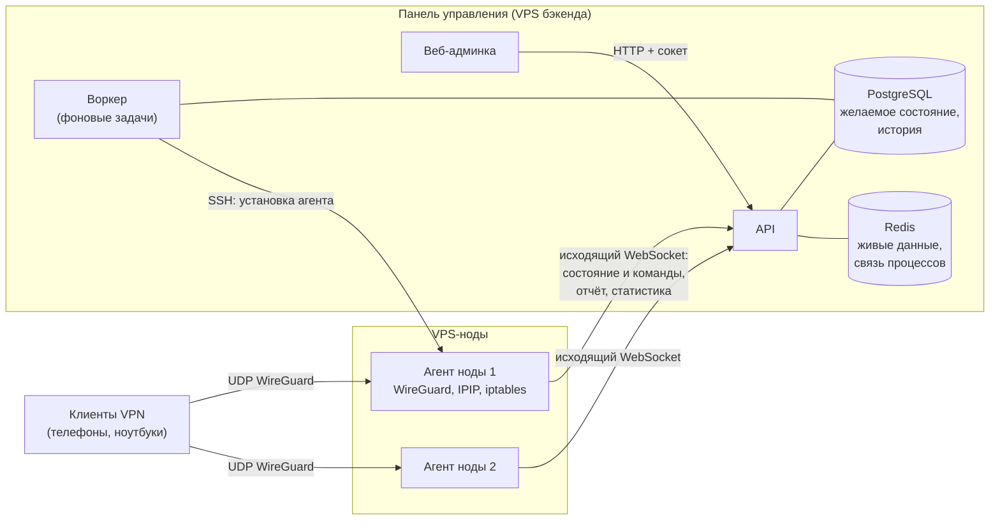
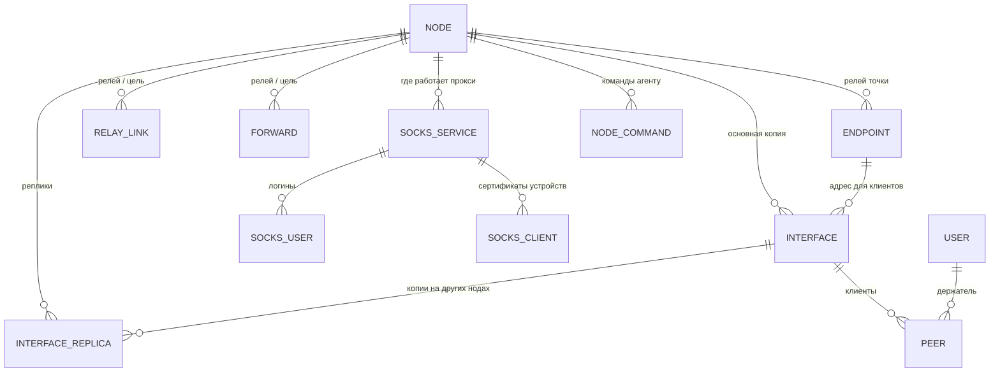
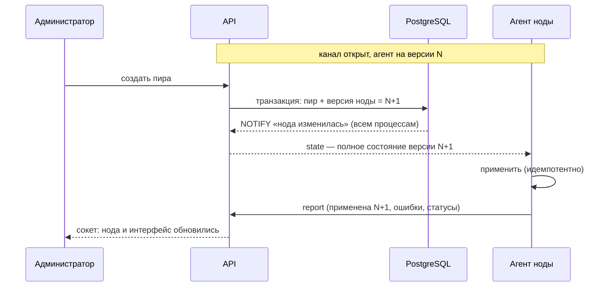
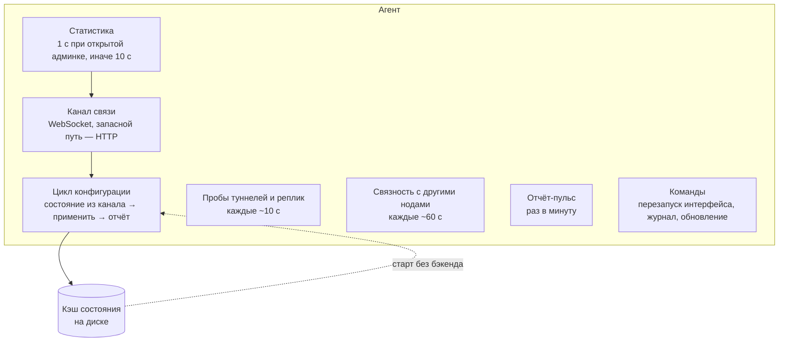
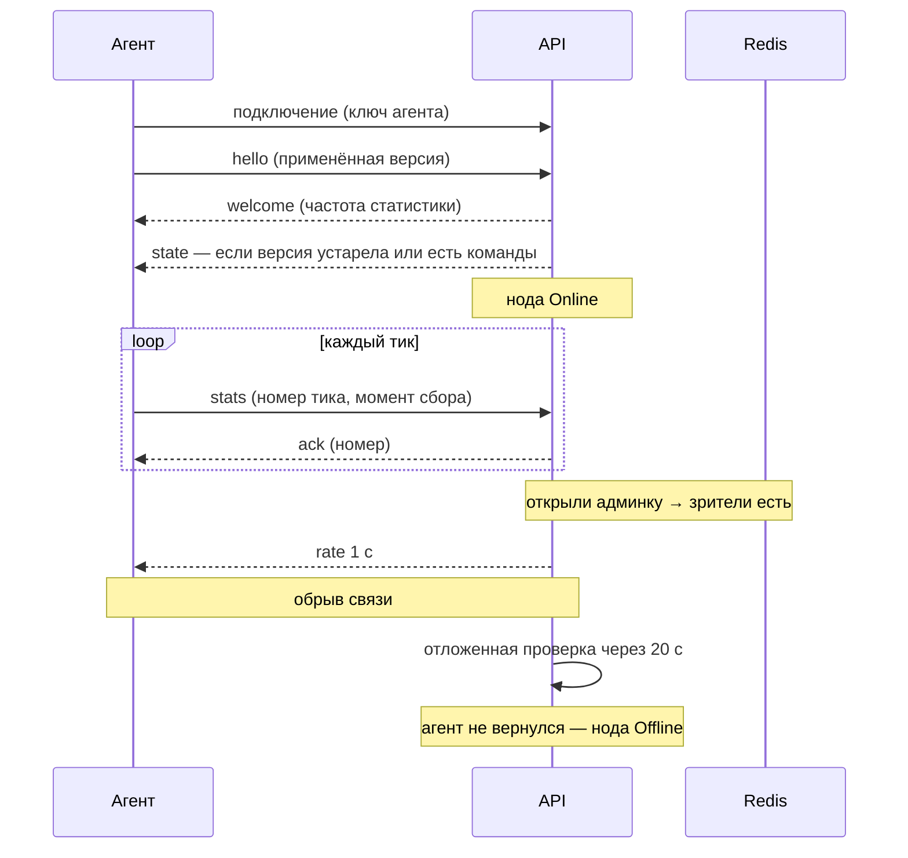
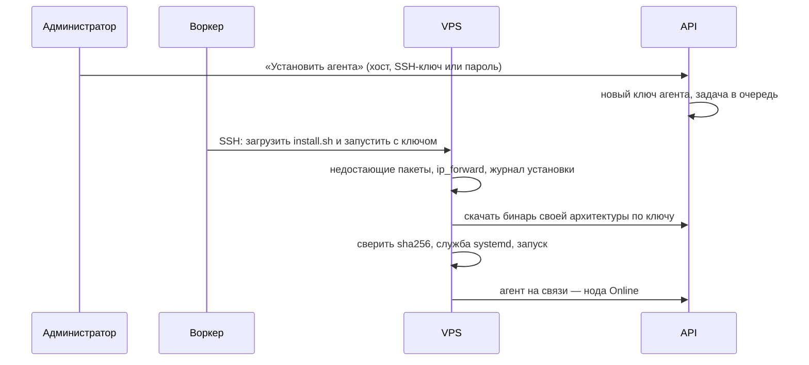
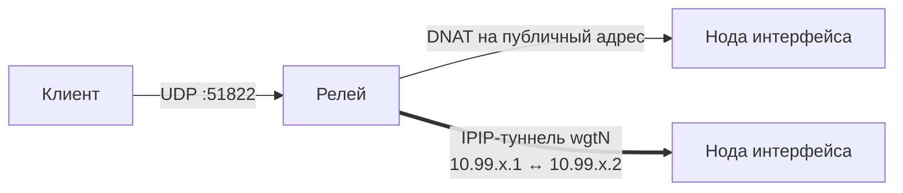
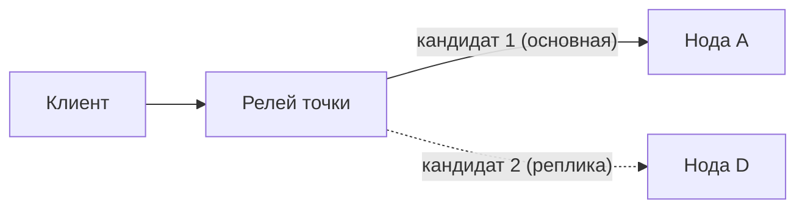
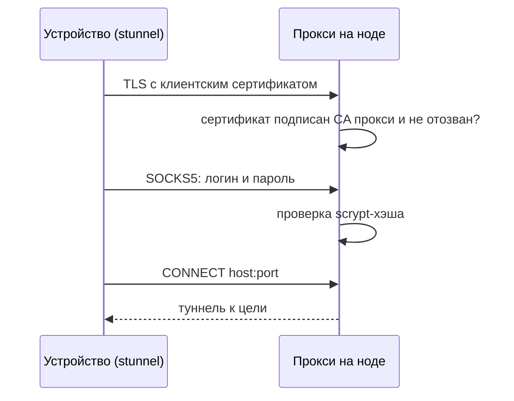
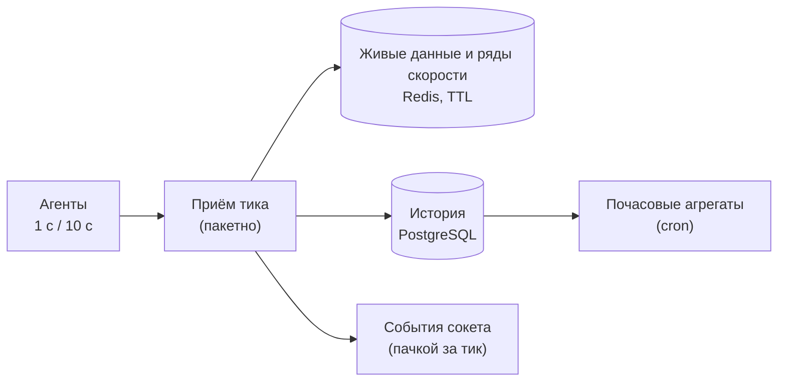

# WG Admin: как устроена система

Документ описывает, из чего состоит админка WireGuard, как части связаны между
собой и что происходит при каждом действии администратора. Кода здесь нет —
только устройство, потоки данных и правила. Детали реализации отдельных
модулей — в `README.md` внутри `src/modules/wg-*` и в `agent/README.md`.

## 1. Общая картина

Система — это **панель управления** (бэкенд + веб) и **агенты** на VPS-нодах.
Бэкенд никогда не выполняет команды на серверах сам: он хранит _желаемое
состояние_ каждой ноды, а агент ноды забирает его и приводит сервер в
соответствие.

Ключевые свойства:

- **Агенту не нужны входящие порты.** Он сам держит исходящее соединение с
  бэкендом (WebSocket, запасной путь — HTTP) со своим ключом; панель не
  подключается к нодам (кроме установки агента по SSH).
- **Декларативность.** Администратор меняет желаемое состояние в БД, агент
  приводит сервер к нему. Повторное применение ничего не ломает.
- **Автономность.** Агент хранит последнее применённое состояние на диске:
  после перезагрузки сервера VPN поднимается, даже если бэкенд недоступен.
- **Реальное время.** Все страницы веба обновляются по сокету, опроса по
  таймеру нет.

## 2. Процессы и хранилища

| Компонент  | Роль                                                                                               |
| ---------- | -------------------------------------------------------------------------------------------------- |
| `api`      | HTTP API, сокет для веба, постоянные каналы агентов (HTTP-протокол агента — запасной путь)         |
| `worker`   | Очередь задач (pg-boss): установка/удаление агента по SSH, периодические задачи                    |
| `migrate`  | Одноразовый запуск миграций схемы БД при деплое                                                    |
| PostgreSQL | Всё постоянное: ноды, интерфейсы, пиры, ключи (зашифрованы), история статистики, задачи            |
| Redis      | Живые данные, общие для процессов: текущая скорость и трафик, здоровье туннелей, матрица связности |

Сигналы между процессами идут через PostgreSQL (`LISTEN/NOTIFY`): изменение
версии ноды или новая команда сразу уходят агенту по его каналу, в каком бы
процессе API ни было соединение.

## 3. Модель данных

| Сущность           | Что это                                                                                                     |
| ------------------ | ----------------------------------------------------------------------------------------------------------- |
| Нода               | VPS с агентом. Публичный адрес, статус агента, версия конфигурации (желаемая и применённая), сведения об ОС |
| Интерфейс          | WireGuard-сервер на ноде: подсеть, порт, ключ, DNS/MTU для клиентов, NAT, точка подключения                 |
| Реплика интерфейса | Копия интерфейса на другой ноде с тем же ключом, адресами и пирами — резерв                                 |
| Пир                | Клиент VPN: ключи, адрес в подсети, срок действия, держатель, трафик и последний handshake                  |
| Точка подключения  | Стабильный адрес, который попадает в конфиги клиентов; напрямую на ноду или через релей                     |
| Релей-линк         | Пара «релей → нода-цель» с собственной /30-подсетью для IPIP-туннеля; создаётся и удаляется автоматически   |
| Проброс            | Порт на релее, ведущий на внешний сервис (UDP/TCP), напрямую или через туннель                              |
| Прокси SOCKS5      | Прокси на ноде: вход по клиентскому сертификату (mTLS), затем логин и пароль                                |
| Команда ноды       | Разовое действие агента: перезапуск интерфейса, журнал агента, обновление. Произвольных команд нет          |

Все приватные ключи (WireGuard, PSK, ключи CA и сертификатов прокси, SSH-ключи
в задачах установки) хранятся в БД зашифрованными ключом приложения
(`WG_SECRETS_KEY`, AES-256-GCM).

## 4. Желаемое состояние и версии

У каждой ноды есть **версия конфигурации**. Любое изменение, которое касается
ноды (интерфейс, пир, точка, проброс, прокси, реплика), в той же транзакции
увеличивает версию всех затронутых нод. Агент применяет состояние и сообщает,
какую версию применил. Совпадение версий — «конфигурация на ноде актуальна».

Состояние всегда передаётся **целиком**, а не изменениями: агент сравнивает его
с тем, что уже стоит на сервере, и трогает только различия.

- Изменились только пиры — `wg syncconf` без разрыва соединений.
- Изменились параметры интерфейса — интерфейс перезапускается.
- Туннель с теми же параметрами не пересоздаётся — трафик релея не рвётся.

Если применить не удалось (порт занят чужим процессом, конфликт туннеля), ошибка
уходит в отчёт и видна на странице ноды. Агент повторяет применение сам.

## 5. Агент ноды

Агент — статический бинарь на Go (Linux amd64/arm64), служба systemd.

### Связь с бэкендом

Агент держит одно постоянное соединение с бэкендом (WebSocket,
`/api/v1/wg-agent/link`, ключ агента в заголовке). По нему идёт всё: бэкенд
присылает состояние и команды сразу при изменении, агент — отчёты, статистику
и ответы на команды.

- **Частота статистики по спросу.** Пока админка открыта хотя бы у одного
  пользователя (признак зрителей — в Redis, общий для процессов), агенты шлют
  статистику раз в секунду, иначе — раз в 10 с. Смена частоты доходит до агента
  сразу.
- **Тики не теряются.** Каждый тик статистики несёт номер и идентификатор
  запуска агента. Неподтверждённые тики агент хранит (до 600) и после
  переподключения досылает по порядку; повторы бэкенд отбрасывает. Момент сбора
  восстанавливается по часам агента, поэтому досланный тик ложится в историю
  своим временем.
- **Быстрый Offline.** Разрыв соединения ставит отложенную проверку: если за
  20 с агент не вернулся (новым соединением или по HTTP), нода — Offline сразу,
  а не по общему порогу молчания.
- **Живость и ключ.** Обе стороны проверяют соединение ping-ом; бэкенд
  перепроверяет ключ открытых соединений раз в минуту — ротация или отзыв
  ключа закрывают канал.
- **Запасной путь.** Если сервер или прокси не пропускают WebSocket, агент
  работает по HTTP-протоколу (long-poll состояния, отдельные запросы для
  отчётов и статистики) и раз в 10 минут снова пробует канал. Способ связи
  виден на карточке «Хост» ноды.
- **Масштабирование.** Соединение агента живёт в одном процессе API; сигналы
  изменений приходят всем процессам через PostgreSQL, поэтому число процессов
  API не ограничено.

**Что агент делает на сервере:**

- поднимает интерфейсы WireGuard (`wg-quick`), NAT через исходящий интерфейс;
- создаёт IPIP-туннели `wgtN` до других нод;
- ставит правила iptables в своих цепочках `WG_ADMIN_*` (пробросы, разрешения
  пересылки) — чужие правила не трогает;
- держит SOCKS5-прокси (TLS с проверкой клиентского сертификата);
- собирает статистику `wg show`, метрики хоста (CPU, память, диск, сеть),
  занятые порты, пингует туннели, реплики и другие ноды.

**Защита от чужого.** Туннель не поднимается, если его подсеть пересекается с
адресом на другом интерфейсе или к тому же хосту уже есть чужой IPIP-туннель.
Проброс не ставится на порт, который слушает другой процесс. Бэкенд знает
занятые порты хоста из отчёта агента и не даёт их выбрать.

**Остановка и перезапуск:**

| Событие                                 | Что происходит                                                                          |
| --------------------------------------- | --------------------------------------------------------------------------------------- |
| Остановка службы (`SIGTERM`), удаление  | Агент откатывает всё своё: интерфейсы, туннели, правила, прокси. Кэш состояния остаётся |
| Переустановка, обновление (`SIGHUP`)    | Перезапуск без отката: интерфейсы и правила остаются, клиенты не теряют связь           |
| Перезагрузка сервера, бэкенд недоступен | Агент поднимает всё из кэша, а когда бэкенд появится — сверяется с ним                  |

### Установка, обновление, удаление

Установщик один и для установки из админки по SSH, и для ручной установки
(`curl …/api/v1/wg-agent/install.sh | sudo sh -s -- --key <ключ>`).

- **Журнал установки** (`/etc/wg-admin/install-state`) запоминает, что было на
  хосте до первой установки: какие пакеты поставлены, исходные значения
  ip_forward, загруженные модули. Удаление возвращает ровно это. Полный снимок
  системы не делается: он затёр бы изменения Docker и другого ПО.
- **Обновление** — команда агенту: он скачивает новый бинарь с бэкенда,
  проверяет sha256 и перезапускается. Если после обновления агент три раза
  подряд не выходит на связь, возвращается прежний бинарь.
- **Удаление** — останавливает агента (он откатывает своё), затем откат хоста
  по журналу и удаление файлов агента. Ключ агента отзывается.
- На Ubuntu 24.10+ установщик разрешает каталог агента в профилях AppArmor
  `wg`/`wg-quick` и убирает это при удалении.

## 6. Точки подключения и релей

Адрес в конфиге клиента (`Endpoint`) выбирается так:

1. есть точка подключения — её хост и порт на точке (или порт интерфейса);
2. иначе — публичный адрес ноды и порт интерфейса.

**Точка «напрямую»** — просто стабильное имя (DNS) ноды. Позволяет менять IP
ноды, не перевыпуская конфиги.

**Точка «через релей»** — клиенты подключаются к другой ноде (релею), а та
пересылает UDP до ноды интерфейса:

- **DNAT** — релей переадресует пакеты на публичный адрес ноды.
- **IPIP-туннель** — релей отправляет пакеты внутрь туннеля до ноды. Нужен, когда
  прямой UDP до ноды теряется или режется (хостер, страна). Туннели и их /30
  адреса (из `WG_RELAY_TUNNEL_CIDR`) система выделяет сама: на каждую пару
  «релей → нода» создаётся ровно один туннель, пока он кем-то используется.
- Порты на релее общие для всех его точек, пробросов и собственных
  интерфейсов — система не даёт выбрать занятый.
- Релей не может обслуживать точку для интерфейса на самом себе.

Здоровье туннелей видно на странице ноды: агенты обеих сторон пингуют дальний
конец каждые ~10 с (задержка, потери, проверка MTU).

## 7. Реплики и переключение

Интерфейс может иметь **копии на других нодах** — с тем же ключом, адресами и
пирами. Любое изменение интерфейса или пира применяется на всех копиях.

- Релей точки держит путь до всех копий и получает их список по приоритету:
  основная первой.
- Агент релея выбирает **первую живую копию** по своим пробам (пинг туннеля или
  адреса). Три неудачи подряд (~30 с) — переход на следующую, первая удачная
  проба — возврат.
- При смене цели агент сбрасывает записи conntrack этого порта, иначе поток
  клиента остался бы на мёртвой ноде.
- Копия, которая сейчас обслуживает трафик, видна в таблице интерфейсов.
  Администратор может **закрепить** трафик на конкретной копии (тогда
  автоматики нет) или вернуть «авто».
- Переключение работает только для интерфейсов с точкой через релей: клиенту
  нужен один постоянный адрес.

**Перенос** интерфейса на другую ноду сохраняет ключ и пиров; с точкой
подключения конфиги клиентов не меняются.

## 8. Пробросы

Проброс — порт на релее, ведущий на сервис, которым панель не управляет
(свой WireGuard в контейнере, TLS-прокси и т. п.). UDP или TCP.

| Путь       | Как идёт трафик                                                                      |
| ---------- | ------------------------------------------------------------------------------------ |
| Напрямую   | DNAT на адрес цели (или публичный адрес ноды-цели)                                   |
| Через IPIP | Нужна нода-цель с агентом: трафик идёт внутрь туннеля, прямой адрес — аварийный путь |

Маршрут для пути через туннель:

- **Авто** — агент релея сам уходит на прямой путь, если туннель не отвечает
  ~30 с, и возвращается, когда туннель ожил;
- **Только туннель** / **Напрямую** — принудительно.

Текущий маршрут виден в таблице пробросов. Заранее созданный выключенный
проброс можно включить, пока порт ещё занят другим процессом, — агент поставит
его сам, как только порт освободится.

## 9. Прокси SOCKS5 через mTLS

Прокси работает в агенте ноды. Вход — в два шага:

- При создании прокси сервис выпускает свой CA (ECDSA P-256) и серверный
  сертификат. На каждое устройство — свой клиентский сертификат.
- Агенту уходят только отпечатки разрешённых сертификатов и хэши паролей.
- **Отзыв сертификата** или выключение пользователя разрывает их текущие
  соединения сразу, без перезапуска прокси.
- Для устройства скачивается готовый архив для macOS: сертификаты, установка
  stunnel, автозапуск, локальный SOCKS5 `127.0.0.1:1080` и ссылка для
  Telegram.
- Прокси может быть доступен клиентам через проброс на другой ноде — тогда
  у прокси указываются адрес и порт для клиентов.
- Порт прокси защищён от пересечения с пробросами.

## 10. Статистика

- **Счётчики монотонны**: сброс счётчиков WireGuard (перезапуск интерфейса)
  компенсируется, суммарный трафик пира не падает.
- **Приём тика** — пакетный: живые данные читаются и пишутся в Redis одним
  проходом, история — одной вставкой, счётчики пиров — одним запросом.
  Точка ставится на момент сбора тика агентом. Тик старше 10 с (досылка после
  разрыва) идёт только в историю, без событий; старше часа — отбрасывается.
- **Живые данные** — текущая скорость и трафик пира, интерфейса, ноды, общей
  сводки — в Redis. Пока админку смотрят, события в сокет уходят каждый тик;
  без зрителей — только при заметном изменении скорости или раз в 30 с тишины.
  Статистика пиров приходит одним событием за тик на комнату: обзору — все
  пиры, странице интерфейса — его пиры, списку своих подключений — пиры
  держателя, карточке пира — только он; без дублей.
- **Ряды скорости** — последние 600 точек скорости ноды, интерфейса и пира
  (Redis). Графики на страницах сразу показывают последние минуты, дальше
  продолжаются по сокету.
- **История**: точка на пира раз в минуту (и при смене онлайн), метрики ноды
  раз в минуту, почасовые агрегаты для длинных периодов. Старые записи
  удаляются по сроку хранения (`WG_STATS_*_RETENTION_*`).
- **Онлайн** пира — handshake свежее 3 минут.
- **Связность нод** — каждая нода раз в минуту пингует остальные; на дашборде —
  матрица «откуда → куда».

## 11. Реальное время

Веб подписывается на комнаты сокета; вход в комнату проверяется правами.

| Комната                                   | Кто может войти              | Что приходит                                                                            |
| ----------------------------------------- | ---------------------------- | --------------------------------------------------------------------------------------- |
| `wg-overview`                             | просмотр статистики          | сводка, скорость нод, изменения нод/интерфейсов/пиров, матрица связности                |
| `wg-node_<id>`                            | просмотр нод                 | нода, её интерфейсы (в том числе реплики), метрики, здоровье туннелей, установка агента |
| `wg-interface_<id>`                       | просмотр интерфейсов         | интерфейс, его статистика, статистика его пиров (пачкой за тик)                         |
| `wg-peer_<id>`                            | просмотр пиров или свой пир  | пир и его статистика                                                                    |
| `wg-peers-own_<userId>`                   | держатель пиров, только своя | статистика своих пиров (список своих подключений)                                       |
| `wg-endpoints`, `wg-forwards`, `wg-socks` | просмотр раздела             | изменения списка, маршрут пробросов, статистика прокси                                  |
| Личный канал                              | держатель пира               | изменения и удаление своих пиров                                                        |

После переподключения сокета страница перечитывает данные и снова входит в
комнаты.

## 12. Доступ

Права выдаются ролями; суперпользователь (`*`) может всё.

| Раздел     | Права                                                                                                                                                                                                                                           |
| ---------- | ----------------------------------------------------------------------------------------------------------------------------------------------------------------------------------------------------------------------------------------------- |
| Ноды       | `wg:node:view` (и метрики), `wg:node:create`, `wg:node:update`, `wg:node:delete`, `wg:node:agent` (ключ и обновление агента), `wg:node:logs` (журнал агента), `wg:node:provision` (SSH)                                                         |
| Точки      | `wg:endpoint:view`, `wg:endpoint:create`, `wg:endpoint:update`, `wg:endpoint:delete`                                                                                                                                                            |
| Интерфейсы | `wg:interface:view`, `wg:interface:create`, `wg:interface:update`, `wg:interface:delete`, `wg:interface:control` (включение, выключение, перезапуск), `wg:interface:move`, `wg:interface:replicas`, `wg:interface:hooks` (свои PostUp/PostDown) |
| Пиры       | `wg:peer:view`, `wg:peer:create`, `wg:peer:update`, `wg:peer:delete`, `wg:peer:toggle` (включение-выключение любых), `wg:peer:psk`, `wg:peer:assign` (владелец), `wg:peer:own` — свои пиры, конфиг и QR, включение-выключение                   |
| Пробросы   | `wg:forward:view`, `wg:forward:create`, `wg:forward:update`, `wg:forward:delete`                                                                                                                                                                |
| Прокси     | `wg:socks:view`, `wg:socks:create`, `wg:socks:update`, `wg:socks:delete`, `wg:socks:users`, `wg:socks:secrets` (пароли пользователей), `wg:socks:clients` (сертификаты и клиенты устройств)                                                     |
| Статистика | `wg:stats:view` — вся, `wg:stats:own` — по своим пирам                                                                                                                                                                                          |

Роль `user` по умолчанию получает `wg:peer:own` и `wg:stats:own`: обычный
пользователь видит только свои подключения.

Свои PostUp/PostDown для интерфейса задаёт только обладатель `wg:interface:hooks`
(или суперпользователь).

Сокет-комнаты проверяют актуальные права из БД на каждом входе; HTTP-запросы —
права из access-токена, который после смены прав отклоняется и обновляется
клиентом.

**Ключ агента** — API-ключ с правом только на протокол своей ноды. Выдаётся при
создании ноды, при ротации и при установке по SSH; секрет показывается один
раз. Агент берёт и завершает только команды своей ноды.

## 13. Фоновые задачи

| Задача                 | Когда               | Что делает                                                               |
| ---------------------- | ------------------- | ------------------------------------------------------------------------ |
| `wg.provision-node`    | «Установить агента» | Установка агента по SSH, прогресс и журнал — в задаче и на странице ноды |
| `wg.uninstall-node`    | «Удалить агента»    | Удаление агента по SSH с откатом хоста                                   |
| `wg.agent-link-lost`   | обрыв канала агента | Агент не вернулся за 20 с — нода в Offline                               |
| `wg.node-offline`      | cron                | Ноды, чей агент молчит дольше `WG_AGENT_OFFLINE_AFTER_SEC`, — в Offline  |
| `wg.command-timeout`   | cron                | Невыполненные команды агенту — в «Таймаут»                               |
| `wg.command-retention` | cron                | Удаление старых команд                                                   |
| `wg.peer-expiry`       | cron                | Выключение пиров с истёкшим сроком                                       |
| `wg.stats-rollup`      | cron                | Почасовые агрегаты статистики                                            |
| `wg.stats-retention`   | cron                | Удаление старой истории                                                  |

Периодические задачи выполняются одним воркером на кластер (расписание в
очереди, не таймеры процессов).

## 14. Развёртывание и настройка

- Бэкенд — один образ для `api`, `worker` и `migrate`. Бинари агента для обеих
  архитектур собираются в том же образе и раздаются агентам с бэкенда.
- `make deploy` — синхронизация исходников, сборка на хосте, миграции, запуск.
- Важные переменные окружения:

| Переменная                                                   | Зачем                                                                       |
| ------------------------------------------------------------ | --------------------------------------------------------------------------- |
| `APP_PUBLIC_URL`                                             | Адрес бэкенда, который увидят агенты (установщик, команда ручной установки) |
| `WG_SECRETS_KEY`                                             | Ключ шифрования секретов в БД. Потеря = потеря всех приватных ключей        |
| `WG_AGENT_LINK_LIVE_STATS_MS`, `WG_AGENT_LINK_IDLE_STATS_MS` | Частота статистики агентов при открытой админке (1 с) и без зрителей (10 с) |
| `WG_AGENT_LINK_OFFLINE_GRACE_SEC`                            | Через сколько после обрыва канала нода — Offline (20 с)                     |
| `WG_AGENT_POLL_WAIT_MS`                                      | Предел ожидания изменений в одном запросе агента по HTTP                    |
| `WG_AGENT_OFFLINE_AFTER_SEC`                                 | Через сколько молчания нода считается Offline                               |
| `WG_RELAY_TUNNEL_CIDR`                                       | Пул адресов для IPIP-туннелей (по умолчанию `10.99.0.0/16`)                 |
| `WG_COMMAND_TIMEOUT_SEC`                                     | Срок команд агенту (`timeoutSec`: агент укладывается в него)                |
| `WG_STATS_*_RETENTION_*`, `WG_NODE_METRIC_RETENTION_DAYS`    | Сроки хранения истории                                                      |

- Прокси перед бэкендом должен пропускать WebSocket на `/api/v1/wg-agent/link`
  (Caddy делает это сам); иначе агенты работают по запасному HTTP-пути.
- Агент ходит к бэкенду по `APP_PUBLIC_URL`. По `http` ключ агента и приватные
  ключи идут открытым текстом — агент (в журнале) и задача установки
  предупреждают об этом;
  для продакшена нужен HTTPS (профиль `https` в compose — Caddy).

## 15. Диагностика

| Симптом                              | Где смотреть                                                                                        |
| ------------------------------------ | --------------------------------------------------------------------------------------------------- |
| Нода Offline                         | Агент не выходит на связь: `systemctl status wg-admin-agent`, `journalctl -u wg-admin-agent` на VPS |
| Связь «HTTP — запасной путь»         | Прокси перед бэкендом не пропускает WebSocket на `/api/v1/wg-agent/link`                            |
| «Ошибка применения конфигурации»     | Текст ошибки на странице ноды; агент повторяет применение сам после устранения причины              |
| Интерфейс в статусе «Ошибка»         | Сообщение у интерфейса и журнал агента (вкладка ноды)                                               |
| Клиент не подключается               | Handshake пира; адрес подключения интерфейса; здоровье туннеля релея; маршрут проброса              |
| Установка агента не прошла           | Журнал задачи установки (построчно, с временем шагов)                                               |
| Правила iptables «не видны» на хосте | Старый `iptables` хоста может не показывать совпадения; смотреть цепочки `WG_ADMIN_*` по агенту     |
